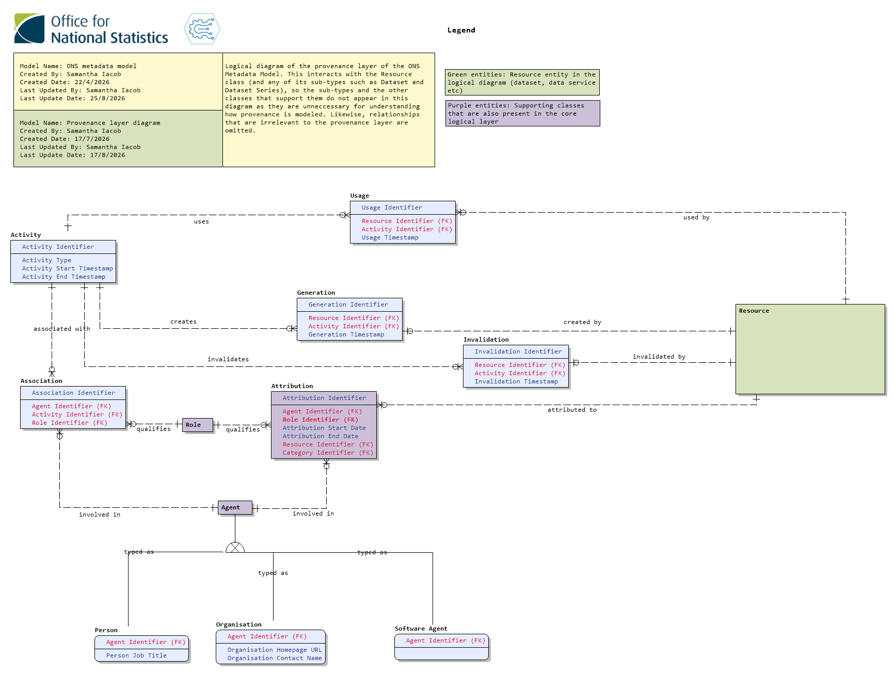
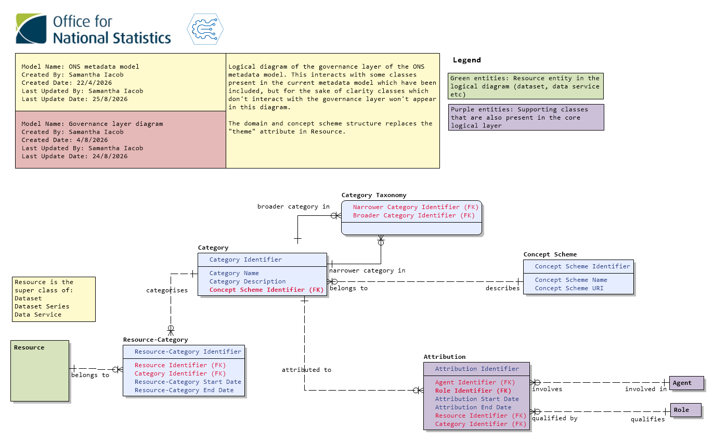

# Model Updates

This is a repository for people to access artifacts around the ONS enterprise-wide **metadata model** and any **metadata profiles** created from it.
This will include reports, documentation, instance diagrams and any other thing useful for understanding the model.

## Introduction

The ONS metadata model describes an enterprise data catalogue which is based on international standards and identified requirements from business areas that will be interacting with it. The model  describes a compliant data catalogue that would work for most general purposes and can be aligned to to promote data discovery, reuse, integration and governance.

It consists of the following artifacts :

- An **enterprise metadata model** (all classes and their properties) with a conceptual and logical view, and once a cataloguing solution is identified a physical diagram as well.
- A **metadata profile** for each business area that requires it (a logical and, where needed or practicable, a physical model of the classes and properties used in that area)
- **Documentation** and, where needed, **instance diagrams** supporting the model and any metadata profiles

## Latest version

**Updated** - Tuesday 25/8/26  
**Erwin Version** - Version 73

## News

Provenance and governance functionality has been added to the model, allowing any system aligned with this design to describe how datasets are generated, transformed and used across the estate. It also allows flexible categorisation of resources (for instance into themes, topics and domains) with people and roles associated with them.

Following discussions within the Data Architecture team we have moved from a semantic versioning system to a date-based one which is tied to main branch commits to this repository. As the model is in a stable state and we're satisfied about the basic functionality (and ability to link out to existing catalogues where that functionality is still missing) the update cycle is likely to slow down and updates to this repository will reflect major changes only.

There have been several changes to classes and properties in the model. Refer to the [reports](documents/reports) for more details. Most significant is the removal of the *theme* property in Resource, which has been replaced with the more flexible governance layer described in the documentation and visible in the diagrams below.

The current guidance for interpreting the metadata model is available here: [Metadata_Model_Documentation](metadata_model/METADATA_MODEL_DOCUMENTATION.md)

The current metadata profile guidance for dissemination is here: [Dissemination_Metadata_Profile](metadata_profiles/dissemination/DISSEMINATION_METADATA_PROFILE_DOCUMENTATION.md). This document isn't standalone and should be read alongside the metadata model documentation.

Please continue to review the Architecture Decision Records in the [documents/decisions](documents/decisions) directory to keep abreast of any recent decisions.

## Diagrams

### Conceptual

### Logical

## To do

We are focusing on priority areas around the Information Data Asset Register and supporting business areas with implementation. In future we will establish a process for submitting requirements and requests for change but for now please get in touch with a member of the Data Architecture Branch with any comments, questions or requests.

## Contact

Message Samantha Iacob on teams or email [samantha.iacob@ons.gov.uk](mailto:samantha.iacob@ons.gov.uk)
I am always happy to discuss ways to improve the model!

