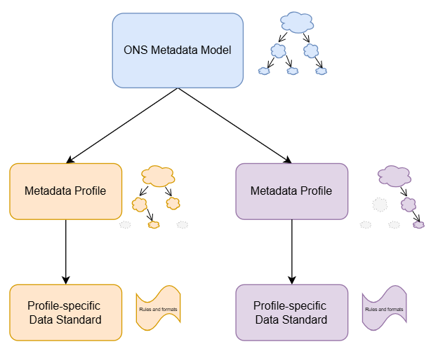
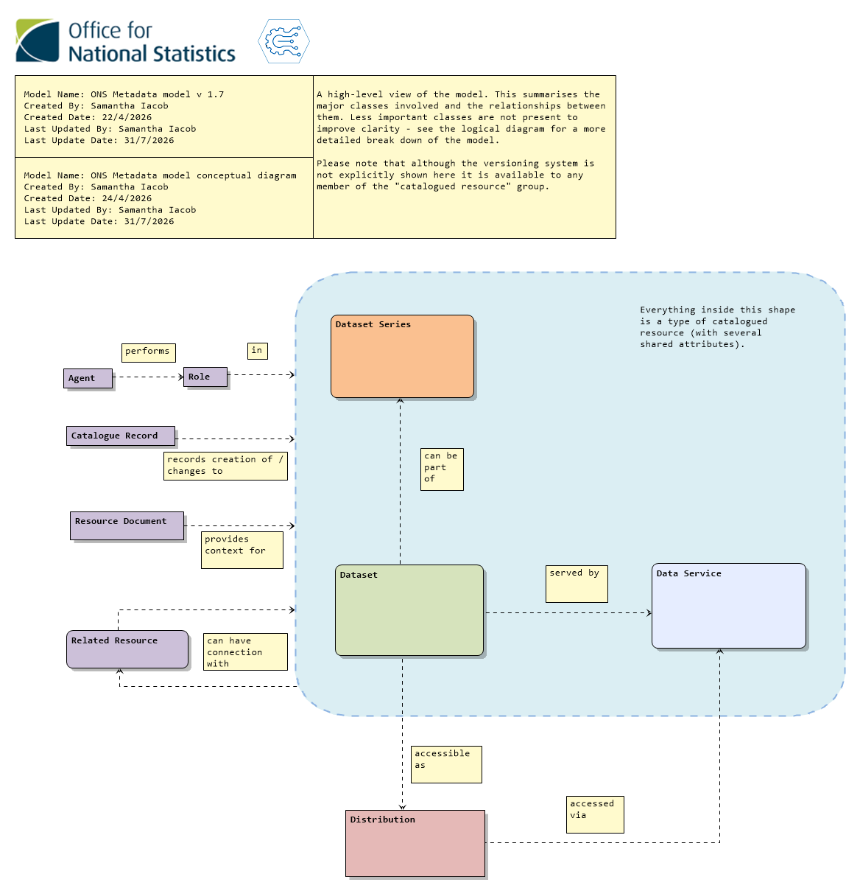
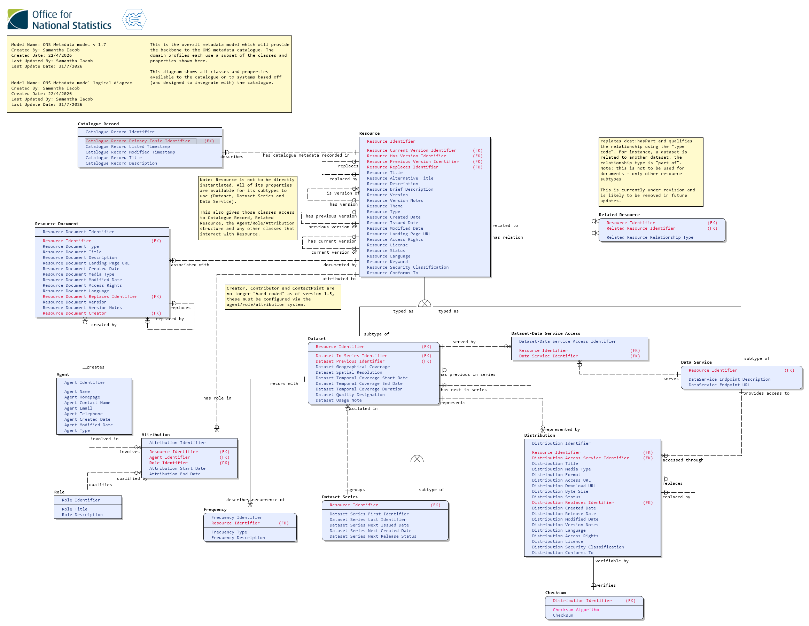
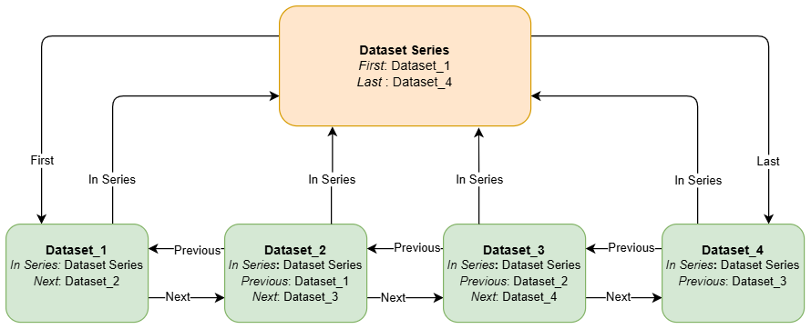
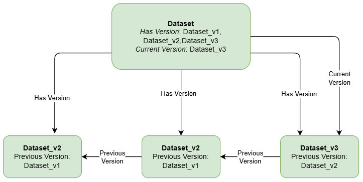
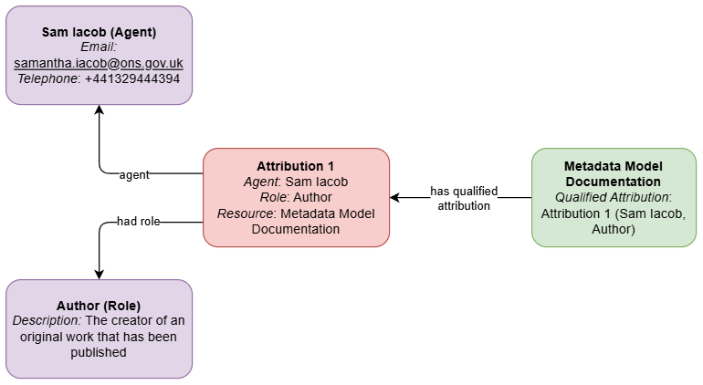
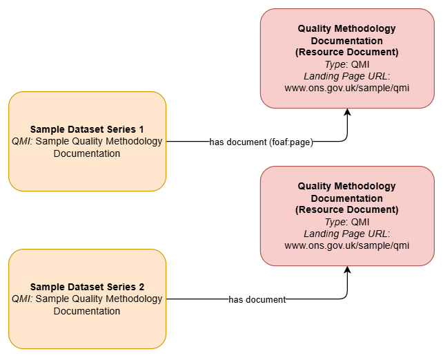

# ONS Metadata Model Documentation

## Table of Contents
- [Governance](#governance)
  - [Version History](#version-history)
- [Model Version Information](#model-version-information)
- [Executive Summary](#executive-summary)
  - [Introduction](#introduction)
- [Purpose](#purpose)
- [Terminology](#terminology)
- [Components](#components)
  - [Conceptual Metadata Diagram](#conceptual-metadata-diagram)
    - [Core concepts](#core-concepts)
  - [Logical Metadata Diagram](#logical-metadata-diagram)
    - [Explanation of key classes](#explanation-of-key-classes)
- [Series](#series)
- [Ad Hoc Datasets](#ad-hoc-datasets)
- [Versioning](#versioning)
- [Agents, Roles and Attribution](#agents-roles-and-attribution)
- [Documentation](#documentation)
- [Metadata fields and language](#metadata-fields-and-language)
- [Next Steps](#next-steps)
- [Further Information & Contact Details](#further-information-contact-details)
  - [Additional Reading](#additional-reading)
  - [Contact Us](#contact-us)

## Governance 

| Approver | Role | Business Area | Date Approved |
|----|----|----|----|
| Charles Baird | Deputy Director | Data Growth and Operations – Data Architecture, Location and Indexing |  |
| Kirti Tandel | Lead Data Architect | Data Growth and Operations – Data Architecture, Location and Indexing |  |

## Model Version Information

This document and its illustrations are based on the ONS Metadata Model version 1.7 (released 31 July 2026). As the model may be updated rapidly at least in the near future, some class and property names may differ between this document and the live model, however the information about how the model works overall is unlikely to change greatly between updates. This document will be revised as the model is developed and time permits but will always be up-to-date for each major version release (once the versioning strategy is settled and there are regular releases, or where there is a breaking change if that hasn't happened).

For the latest version of this model please refer to the model’s [GitHub repository](https://github.com/ONSdigital/enterprise_metadata_model_updates).

## Executive Summary

### Introduction

The Data Architecture Branch in DPSG (Data Products, Services and Governance) are designing and implementing a strategic metadata framework to support data discovery, governance, quality, reuse, exchange and automation. A key part of this work includes designing a coherent enterprise-wide metadata model that defines the key classes and properties for a future metadata catalogue.

This model will also furnish each business area with a tailored subset of those classes and properties where required. This subset, along with other supporting documentation, is known as a *metadata profile*. A metadata profile constrains the model for a specific business purpose and supports technical implementation alongside their associated *profile data standard*.

As profiles may "detach" from the model during implementation (for instance the metadata model might progress during development of a solution), work will be needed to ensure that the differences between the evolving metadata model and its profiles are understood so they can be aligned when practicable.  The document focuses primarily on the ONS metadata model - although metadata profiles will be explained briefly here, they will be covered in more detail in their separate future releases.

## Purpose

The purpose of this document is to explain the ONS metadata model and how it meets the requirement for an enterprise-wide, standards-aligned model which can be used to develop metadata profiles across the statistical production process.

The model and supporting metadata profiles are intended to:

- Support consistent implementation across data platforms, pipelines, and catalogues;

- Enable governance and auditability, including provenance and versioning, and support approval tracking and agreement‑level constraints as the ONS Data Catalogue matures;

- Improve discoverability and reuse of data by providing uniform metadata structures;

- Ensure interoperability with open standards where possible such as DCAT, DDI-CDI, DCMI, FOAF, and SKOS.

Each metadata profile will be accompanied by a formal data standard for that profile which will guide technical implementation.

## Terminology

*Class* has been used to describe the main entities or subjects involved in the model. These appear as boxes on the diagrams.

A *Property* is an attribute of a class. In the logical model these are listed inside the boxes.

A *Relationship* describes how two classes interact with one another. These appear as labelled lines between the boxes on the models.

The naming convention of classes and properties closely follow the DCAT vocabulary or a compatible international standard, with some adjustments to meet ONS-specific requirements at the logical modelling level. Some differences may occur as our logical modelling standards require us to name properties in a certain way, or if a particular property or class is needed to meet a requirement.

## Components

The *ONS Metadata Model* defines standardised metadata elements, structures, and rules needed to describe data consistently across all the ONS estate. It ensures metadata captured across systems is standardised, interoperable, and ready for use in the data catalogue and across the business. It consists of *Conceptual* and *Logical* data diagrams containing all classes and properties available to the business. When a cataloguing solution is identified it will also contain a *Physical* diagram allowing the model to be implemented in the catalogue.

A *Metadata Profile* is a specialised subset of the ONS metadata model for a particular use case or a business area, and includes logical and physical data diagrams defining the relevant metadata requirements, vocabularies, and constraints in a machine-readable way. It defines the specific, enforceable metadata requirements for a particular subject area or profile, ensuring that metadata captured within that profile is consistent, governed, and aligned to the organisation wide models and standards.

A Profile-Specific *Data Standard* defines the agreed rules, formats, and quality expectations for how specific types of data and metadata must be structured and recorded, ensuring consistency, interoperability, and reliable reuse across systems and dissemination processes.

### Conceptual Metadata Diagram

A conceptual metadata diagram explains the structure of the catalogue using only the core concepts and the relationships between them. It isn’t detailed enough to inform a functional catalogue on its own but is designed to be easy to read and communicate:

#### Core concepts

The catalogue is primarily focused on the classes within the filled blue area - *catalogued resources*. At present these are *Datasets*, *Dataset Series*, and *Data Services*. These have a number of similar properties which allow for them to be identified in the catalogue and for version control, and they also have access to supporting classes such as Resource Document and Actors/ Roles (these will be described in more detail later)

A *Dataset* in this model describes any collection of data which is published or curated by a single agent and is available for download. A data delivery from a supplier, a published statistical output or a lookup table are examples of datasets in the ONS estate.

A *Dataset Series* is a collection of datasets that are published separately but are grouped by a shared characteristic. These have special properties to enable an ordered collection but no order is required. A regular publication would be an example. Individual datasets are also expected to belong to a Dataset Series (see below).

A *Data Service* in the catalogue describes a method by which data is accessed - for instance an API or storage method. SharePoint is a data service providing access to the information stored there, for instance.

A dataset is accessible as one or more *Distribution(s)*, which is a specific representation of the dataset including details of its storage location, its file size and media type.

Resources are supported by the *Resource Document* class which identifies and links to documentation supporting a dataset or data service, such as quality management information documents or memoranda of understanding.

Resources are related to one another as a *Related Resource*. This class links datasets to publications, or similar but distinct publications to one another. Please note that this class is a candidate for removal in future updates of the model so please use this with caution.

A *Catalogue Record* provides information about the creation of resources in the catalogue rather than the resources themselves. For instance, it records when a dataset was added to the catalogue, but not when the actual dataset was published. 

An *Agent* is a person or an organisation who carries out some *Role* , or function, in relation to a resource. The Population Statistics team may be the data steward of a dataset or dataset series. *Attribution* links a particular Agent carrying out a Role to a Resource.

For more details about class and property definitions please see below and refer to the [Reports](https://github.com/ONSdigital/enterprise_metadata_model_updates/tree/main/reports) section of the model’s GitHub repository.

### Logical Metadata Diagram

The logical metadata diagram explains data structures in a way that is independent of a particular technology. It’s a more detailed blueprint which incorporates business logic and which forms the basis of physical models and database/catalogue design.

#### Explanation of key classes

###### Resource

The Resource is the largest class in the model if you go by the number of properties it has, however it’s not intended to ever be used directly (you would never register an object of the Resource class in the catalogue). It’s a *supertype* which contains properties which are common to its *subtypes* - the Dataset and Data Service classes.

This means that a Dataset could use *Title*, *Description*, *Created Date*, the version identifiers, and more (what properties a dataset would actually use from Resource is defined by the relevant metadata profile or the physical model in the case of the catalogue itself). Datasets and Data Services also have properties of their own, which they can use in addition to anything in Resource. Dataset Series is a subtype of Dataset, which means it can use any of its own properties, **and** any property available to Dataset or Resource.

Importantly, its relationships are also inherited by its subtypes. A Dataset, Dataset Series or a Data Service can have Related Resources and have associated Resource Documents and so on.

###### Dataset Series

The Dataset Series is intended to be used as a container for datasets. As it can use all the properties and relationships of dataset and resource classes, it’s an appropriate place to attach high-level information that applies to every dataset belonging to a collection such as the identity of the Data Steward. It also has properties that help keep the datasets in the series organised and indicate when the series is next expected to be added to.

A Dataset Series can have different values in its properties than the individual datasets that make it up - for instance a dataset might have a temporal (time) coverage of one year but ten of them in a series together have a coverage of ten years.

###### Dataset

A dataset is any collection of data, published or curated by a single agent (which includes organisations and individuals) which can be accessed or downloaded. A dataset can contain datasets and we would envision a structure where a dataset is made up of one or more versions, each of which links to a distribution. See the versioning section below for an illustration of how this is intended to work.

###### Data Service

This class provides details about the endpoint of a method for accessing a dataset or its distributions.

###### Distribution

The Distribution contains all the details about where and how a particular representation of a dataset can be accessed. It is *not* considered a catalogued resource in its own right, and doesn’t have access to any resource properties or relationships.

###### Resource Document

This class captures basic information about a document in relation to a particular catalogued resource only. The document itself isn’t catalogued, and a document can’t be created in the catalogue without reference to the resource it is supporting.

## Series

As described earlier, a Dataset Series is a container for datasets that have something in common - for instance an annual publication or monthly ingest. Throughout all metadata profiles we expect that most datasets will be part of a series, especially where the dataset is significant, has quality information or legal documentation attached, and/or is expected to be repeatedly delivered, produced or published. This will provide a consistent structure across the organisation and allow a common top level when dealing with datasets that will let us attach the same kind of information (owners, associated documentation, etc) at the same level in the catalogue.

Dataset series work by indicating the first and last datasets in the series. Each dataset in the series identifies the series it belongs to, and the previous and next in the series. This allows a chain to be built. If there is only one dataset in a series then these details can be added as more datasets are included.

*Previous* and *Next* (which are properties of Dataset) are used to identify where a dataset is ordered in a series. These are unused if there is only a single dataset in a series, or if the ordering isn't meaningful.

## Ad Hoc Datasets

User-requested datasets are an example of ad hoc datasets. These are one-off datasets that are produced or published with a minimal amount of supporting information to support a business or user need. These do not need to belong to a Dataset Series. While they have access to all the same properties and supporting classes as any other dataset, it’s unlikely they will be versioned or attached to significant amounts of documentation. A minimal ad hoc dataset may be as simple as a dataset instance associated with a distribution. Their actual usage will depend on the relevant metadata profile or business area.

## Versioning

This model provides two different methods of versioning, *version* and *replace*. Properties relating to these are found in the Resource class and are available to all catalogued resources. Distributions and Resource Documents only have the *replace* method available.

##### Version method

The typical method of version control used for datasets where previous versions are preserved and intended to be accessible. This involves datasets being constructed in two layers - an abstract layer which acts as a container for all of its versions and points to its latest version using the properties *Has Version* and *Current Version*, and the individual versions in the lower layer linked to one another with *Previous Version*.

This will create a minimal version chain. The versions can be further fleshed out with a version name or number and version notes using the appropriate properties.

This construction is common in the W3C standards (for instance DCAT and Provenance) and are sometimes referred to as *Supra* and *Infra* layers.

##### Replace method

Replace is used in the same way but only where a new version completely supersedes or replaces the other and the previous version isn’t intended to be accessed or preserved. It uses the property *Replaces* rather than *Previous Version*. While it is available to datasets for extremely minor changes (for instance limited corrections that wouldn't imply a full version change) it is mainly expected to be used in distributions where a change in distribution completely replaces the file that will be accessed. It doesn’t necessarily imply a version chain so shouldn’t be used if the version chain is important.

For more in-depth information please see the [DCAT explanation of versioning](https://www.w3.org/TR/vocab-dcat-3/#dataset-versions).

## Agents, Roles and Attribution

The Attribution system allows for any number agents (people, teams and organisations) and their roles to be related to a catalogued resource. The attribution class enables basic tracking of the validity of an attribution as well - for instance if it has an end date, we know that person is no longer performing that role (for the sake of simplicity this isn’t included in the below illustration, showing how a contributor to a dataset could be identified)

A catalogued resource may have any number of attributions associated with it, covering such roles as Creator, Contributor, Publisher, Data Steward, Information Asset Owner, Researcher and Stakeholder. 

## Documentation

Documentation is linked to a catalogued resource using the Resource Document class. Each instance of this class is intended to capture the minimal amount of metadata about a document in relation to a particular resource. Depending on the application this will typically include a title, a type and a location to access it. Therefore even if multiple resources are supported by the same document (for instance, multiple dataset series covered by the same QMI documentation), each resource will be linked its own resource document as per the diagram below.

The Resource Document class has access to several additional properties including a named creator and a versioning system that is similar to that of the Distribution class in case that information is required.

## Metadata fields and language

Welsh language metadata fields are important to meet our commitment to promote the Welsh language, especially as much of the ONS is based in Wales. These have not been modelled owing to a lack of time and Welsh language expertise but it is a topic that is under consideration and will be addressed in future versions of the model and metadata profile.

## Next Steps

The model is currently being developed by the Enterprise Metadata Management project team in the Data Architecture Branch. Aside from expanding the classes and properties to meet requirements of the business areas wanting to align their systems with the ONS Metadata Model and building metadata profiles for those areas, a non-exhaustive lists of next steps includes:

- Building out controlled vocabularies, especially type lists and roles

- Modelling concept schemes, giving the metadata model the ability to adapt to the needs of different phases of the statistical production process as defined by the [Generic Statistical Business Process Model](https://www.unescap.org/sites/default/d8files/event-documents/GSBPM_v5.1_R_for_SBP_8-18Apr2024.pdf).

- Developing a provenance capability for the catalogue

## Further Information & Contact Details

### Additional Reading

The metadata model is based mostly on DCAT, preferring to take classes and resources from standard vocabularies and their approved extensions. More information can be found below:

[DCAT version 3 (Data Catalogue Vocabulary)](https://www.w3.org/TR/vocab-dcat-3/)

The model reports identify which vocabulary each class and property has been derived from.

### Contact Us

If you have been forwarded this file or found it somewhere on your travels: the ONS Metadata Model and metadata profiles are hosted on a public [GitHub repository](https://github.com/ONSdigital/enterprise_metadata_model_updates). Of particular interest within the repository are [the entity definition and logical dictionary reports](https://github.com/ONSdigital/enterprise_metadata_model_updates/tree/main/documents/reports) and [the Architectural Decision Record](https://github.com/ONSdigital/enterprise_metadata_model_updates/tree/main/documents/decisions) which lists all decisions made about the model and who made those choices. 

Please reach out to one of the repository contributors in the first instance.
