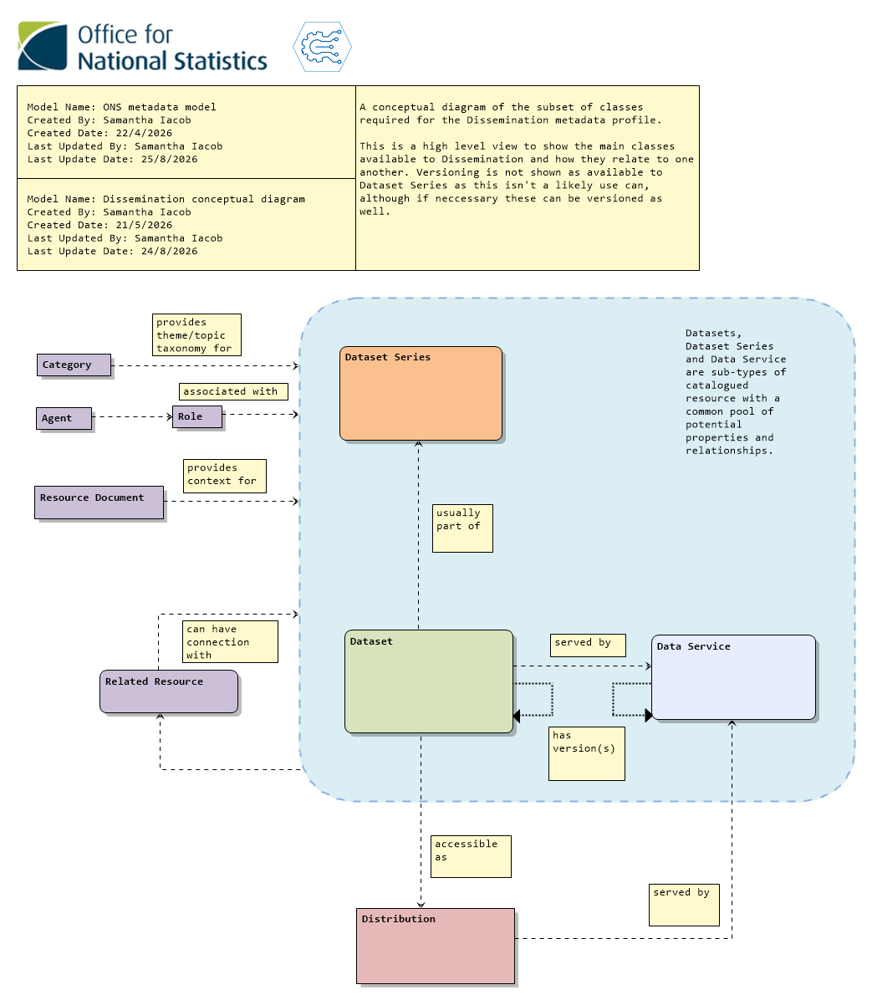
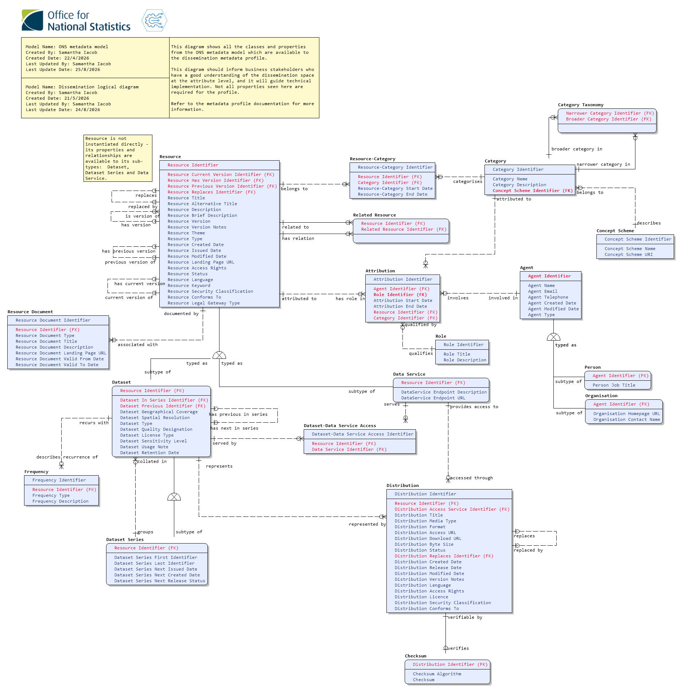
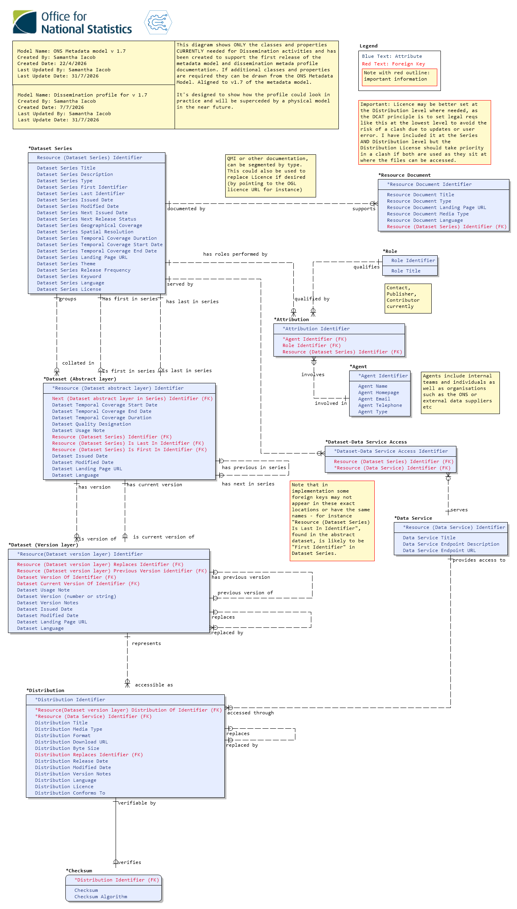
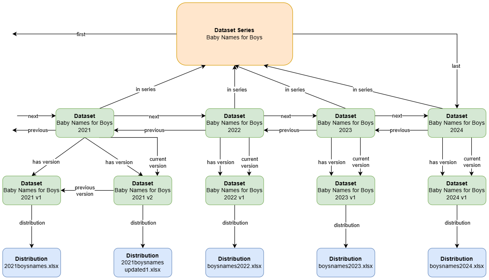
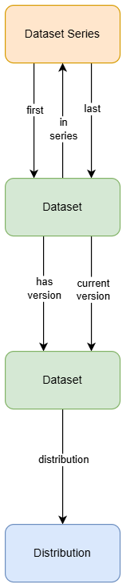
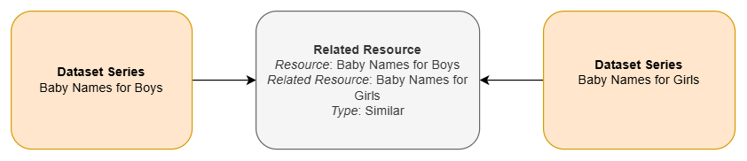

# Dissemination Metadata Profile Documentation

## Table of Contents
- [Governance](#governance)
- [Model Version Information](#model-version-information)
- [Purpose](#purpose)
- [Conceptual metadata diagram for Dissemination](#conceptual-metadata-diagram-for-dissemination)
- [Logical metadata diagram for Dissemination](#logical-metadata-diagram-for-dissemination)
- [Metadata profile diagram for Dissemination](#metadata-profile-diagram-for-dissemination)
  - [Metadata profile diagram notes](#metadata-profile-diagram-notes)
- [Instance diagram for typical dataset series and its distributions](#instance-diagram-for-typical-dataset-series-and-its-distributions)
  - [Instance diagram notes](#instance-diagram-notes)
- [Metadata fields and language](#metadata-fields-and-language)
- [Datasets and Dataset Series](#datasets-and-dataset-series)
  - [Minimal published dataset structure](#minimal-published-dataset-structure)
  - [Themes](#themes)
  - [Dates](#dates)
  - [Frequency and Releases](#frequency-and-releases)
  - [Usage Notes and Version Notes](#usage-notes-and-version-notes)
  - [Quality Designation](#quality-designation)
- [Documentation](#documentation)
- [Related Resources](#related-resources)
- [Data Service](#data-service)
- [Distribution](#distribution)
  - [Download URL](#download-url)
  - [Distribution Description](#distribution-description)
  - [Media Type and File Format](#media-type-and-file-format)
  - [Conforms To](#conforms-to)
- [Agent, Role and Attribution](#agent-role-and-attribution)
- [Next steps](#next-steps)
- [Further Information & Contact Details](#further-information-contact-details)
  - [Additional Reading](#additional-reading)
  - [Contact Us](#contact-us)

## Governance 

| Approver | Role | Business Area | Date Approved |
|----|----|----|----|
| Charles Baird | Deputy Director | Data Growth and Operations – Data Architecture, Location and Indexing |  |
| Kirti Tandel | Lead Data Architect | Data Growth and Operations – Data Architecture, Location and Indexing |  |

## Model Version Information

This document is currently based on the ONS Metadata Model version 1.7 (released 31 July 2026). 

## Purpose

This document details a metadata profile, a subset of the overall metadata model tailored for a particular part of the statistical production process. As such it doesn’t discuss the model more generally or go into detail on areas which are common to all parts of the business (such as versioning using the model, how agents, roles and attributions work or what the major classes are). It also doesn’t have any detail on concepts such as modelling levels or what a metadata profile *is.* It’s recommended that you first read the *Metadata Model Documentation* which is available in the [GitHub repository](documents/METADATA_MODEL_DOCUMENTATION.md).

Please note that this is still going through an approval process and may change. In future it will be accompanied by a physical model and schema for implementation, guidance relating to the schema and standards that apply for the metadata profile, but for now it should still be of use to anyone trying to understand how the metadata model will apply to the dissemination phase of the statistical production process. Feedback would be very gratefully received.

## Conceptual metadata diagram for Dissemination

## Logical metadata diagram for Dissemination

Please note that these diagrams show all the classes and properties that are *available* to the dissemination profile from the metadata model - you may not need to use all the properties.

## Metadata profile diagram for Dissemination

### Metadata profile diagram notes

The diagram shows a entity-relationship diagram model which shows how the classes and properties introduced in the previous diagrams would be used in the dissemination context. A further step is required for implementation from here - a physical model and schema, which may entail changing the property names or where they appear in the model to meet the specific requirements of the system it is implemented in.

The asterisk before the entity names in the diagram is due to a limitation in the data modelling software and can be ignored.

## Instance diagram for typical dataset series and its distributions

### Instance diagram notes

This instance diagram shows only the relationships between dataset series, datasets and distributions in a typical publication on the ONS website. It doesn’t display the other properties which are expected to be populated at the various levels.

The top level is the dataset series level which corresponds to <https://www.ons.gov.uk/peoplepopulationandcommunity/birthsdeathsandmarriages/livebirths/datasets/babynamesenglandandwalesbabynamesstatisticsboys> . This is what the website calls a *dataset*. A dataset series can be identified as it will have “first” and “last” identifiers corresponding to the first and last datasets in the series.

The next level down is the annual/regularly published datasets, which are named *editions* on the website. An example is the 2021 Edition which can be found here: <https://www.ons.gov.uk/peoplepopulationandcommunity/birthsdeathsandmarriages/livebirths/datasets/babynamesenglandandwalesbabynamesstatisticsboys/2021> . These can be identified as they will have an “in series” identifier, showing which series they belong to.

Below this are what are called *versions* on the website. These can be identified by the “distribution” identifier, which points to a particular accessible representation of the dataset. It’s expected that all datasets will have at least one version but can have more. Versions are linked to their immediately preceding version using the “previous version” identifier. This allows a version chain to be built.

At the bottom of the instance diagram are the *distributions* which provide a link to the downloadable file and some additional metadata (file size, name, etc). Each version of a published dataset must have at least one distribution.

## Metadata fields and language

Welsh language metadata fields are important to meet our commitment to promote the Welsh language, especially as much of the ONS is based in Wales. These have not been modelled owing to a lack of time and Welsh language expertise but it is a topic that is under consideration and will be addressed in future versions of the model and metadata profile.

## Datasets and Dataset Series

### Minimal published dataset structure

Published datasets must have the minimal structure of a dataset series, two levels of dataset (a dataset that contains all its versions and points to the latest version), and a distribution.

Even if there is only one dataset in a series and a single version this will allow the series and versions to expand over time as needed. It provides a consistent structure that allows certain properties to be completed at certain levels (for instance, QMI documentation and the actors and roles associated with a dataset will sit at the dataset series level, and version notes will sit at the lower dataset level).

A possible exception may be for ad hoc datasets (including user-requested data). These do not need to belong to a series or be versioned. Instead they are constructed as a dataset linked directly to one or more distributions.

### Themes

In this model *Resource Theme* combines the concepts of Theme and Topic. As a topic can have only one parent theme, this means that a parent theme can be derived from a topic.

This means that for this profile *Resource Theme* can be entered as an array, with the primary theme and/or topic being the first entry in the array.

It’s noted that Digital Publishing wants editorial control of the theme and topic ontology and work needs to be done to manage the source of truth here.

### Dates

Datasets have access to three dates - *Created, Issued* and *Modified Dates.* For this profile the only required date is *Resource Issued Date* which refers to the datetime a resource is published or made publicly available for the first time.

### Frequency and Releases

This should be found at the Dataset Series level. Although more than one Frequency is possible, the Frequency required by Dissemination is the publication frequency. Dataset Series also contains a property called *Dataset Series Next Issued Date* which is the projected date of the next publication in a series, and *Dataset Series Next Release Status* which gives further details. These are both optional.

### Usage Notes and Version Notes

In previous iterations of the model, Alerts and Usage Notes were types of Annotation which were used to display a message on a website. This was reviewed and it was decided to fold Alerts and Usage Notes into a *Usage Note* property which is available to Dataset and Dataset Series classes, and for the Annotation class to be removed. This will be reviewed in future.

Use cases for Alerts such as notifying that a data series has been discontinued would be better covered through the *Resource Status* property, which is intended to work as a flexible lifecycle indicator that should cover any stage a dataset is in.

Version Notes, which show changes between versions of a dataset or distribution, are supplied at the lower level of Dataset in the illustration (the versioned dataset) using the property *Resource Version Notes*. These are also available at the Distribution level if needed, using *Distribution Version Notes.*

### Quality Designation

The ONS Metadata Model currently has no mechanism for managing quality, so as a stopgap measure this is an enumerated list which should allow a choice of accredited official, official or official-in-development. This is likely to change in future.

## Documentation

Documentation is not directly managed by the model but is instead captured by the Resource Document class. An instance of this class represents a document (which could be anything broadly construed as a “document” but is assumed for dissemination purposes to be an electronic record which is accessible at a URL) *in relation to a particular resource* (most likely a dataset series). This means that if the same document refers to more than one resource, each resource will capture that connection in a separate Resource Document instantiation.

For dissemination purposes the minimum information needed for Resource Documentation is:

- *Title*

- *Description*

- *Type (for instance, QMI)*

- *Landing Page URL*

The other properties available to Resource Documentation shouldn’t be required. Please see the Metadata Model Documentation for more information on this class.

## Related Resources

The Related Resource class is able to link resources to one another as shown above, linking two dataset series together based on their conceptual similarity. This could be used in future to show users other publications that could be of interest to them. The *Type* property describes how the resources are linked. While this has been flagged as of potential use in the future it is currently under review and is likely to be removed as the provenance layer of the model is added. As such it is not represented in the profile diagram and may be removed before release of the dissemination metadata profile if no immediate use is found for it.

## Data Service

A dataset should be served by one or more data services, and a distribution should be served by only one. Data services include APIs, servers or any collection of operations that give access to data.

As a sub-type of Resource, Data Service may also be versioned in the same way as Datasets, with an abstract higher layer pointing to the current version and a version chain built using “Replaces” or "Previous Version" where both are active at the same time. This would allow the same Distribution to be accessed via multiple versions of an API without requiring a new Distribution to be created for each version.

Validity of a data service can be detailed in the Data Service’s *Resource Description* property and using *Resource Status*.

## Distribution

### Download URL

The Distribution Download URL is the location that the file is downloadable from. Each distribution will likely relate to a single file so for CSV-W there should be a separate distribution and download URL for its CSV and JSON components. These are linked at the Dataset level, at the lowest level of abstraction (in general, the version will point to one or more distributions).

### Distribution Description

As it is useful to have both the OpenAPI specification and the Developer Hub HTML version that is rendered from this specification, the *Distribution Description* should be an array of two URLs, with the first URL pointing to the OpenAPI spec and the second pointing to the HTML version.

### Media Type and File Format

The *Distribution Media Type* is an enumerated list which encompasses most common file types (based on the [IANA Media Types list](https://www.iana.org/assignments/media-types/media-types.xhtml). File Format is intended to be used for a file type that isn’t found in this list. If *Distribution Media Type* is filled out the *Distribution File Format* is unnecessary.

### Conforms To

Conforms To refers to a standard rather than a schema. If Distribution Conforms To is used in this area, for example for a CSV that forms part of a CSV-W, it would contain the URL for the CSV-W standard (<https://w3c.github.io/csvw/syntax/> for instance) rather than the URI for that file’s associated JSON.

## Agent, Role and Attribution

For the dissemination metadata profile there are three major roles that should be present in a dataset - the contact, publisher and contributor(s). These are created using the Agent, Role and Attribution classes described in the Metadata Model Documentation. The minimum metadata for each in this profile is the *Role Name*, *Agent Name* and *Agent Email*. For the publisher and contributors a homepage URL is also required. Contacts may optionally also have a phone number.

The Agent can be a named individual, a team or an organisation. Organisations require a name and a HTTP address, and teams and individuals require an email address and optionally a phone number.

## Next steps

- Understand the theme and topic taxonomies and establish how a central source of truth will be maintained/mirrored.

- Produce a physical model and template schema.

## Further Information & Contact Details

### Additional Reading

The metadata model is based mostly on DCAT, preferring to take classes and resources from standard vocabularies and their approved extensions. More information can be found below:

[DCAT version 3 (Data Catalogue Vocabulary)](https://www.w3.org/TR/vocab-dcat-3/)

The model reports identify which vocabulary each class and property has been derived from.

### Contact Us

If you have been forwarded this file or found it somewhere on your travels: the ONS Metadata Model and metadata profiles are hosted on a public [GitHub repository](https://github.com/ONSdigital/enterprise_metadata_model_updates). Of particular interest within the repository are [the entity definition and logical dictionary reports](https://github.com/ONSdigital/enterprise_metadata_model_updates/tree/main/documents/reports) and [the Architectural Decision Record](https://github.com/ONSdigital/enterprise_metadata_model_updates/tree/main/documents/decisions) which lists all decisions made about the model and who made those choices. 

Please reach out to one of the repository contributors in the first instance.
